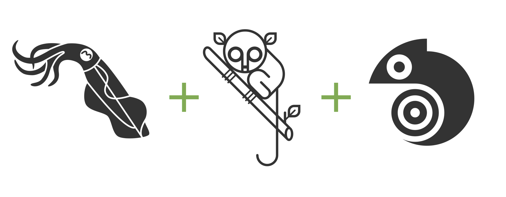

Tutorials provides step-by-step guides to learn how to use the [Sepia](https://github.com/neuromorphic-paris/sepia), [Tarsier](https://github.com/neuromorphic-paris/tarsier) and [Chameleon](https://github.com/neuromorphic-paris/chameleon) libraries.

The tutorials are held in the [wiki](https://github.com/neuromorphic-paris/tutorials/wiki). This repository contains the result files produced during the tutorials.

# install

You do not need to clone this repository to follow the tutorials. Nonetheless, if you want to download the tutorials' result files, run the command:
```sh
git clone --recursive https://github.com/neuromorphic-paris/tutorials.git
```
Each tutorial has its own copy of the upstream libraries (Sepia, Tarsier and Chameleon), so that each directory may be used as a boilerplate for your projects. Thus, cloning the whole directory takes time and space. If you are only interested in cloning one of the tutorials, clone the repository without the submodules, then manually pull the tutorial of interest's submodules. As an example, to setup only the blob tracker example:
```sh
git clone https://github.com/neuromorphic-paris/tutorials.git
cd tutorials/examples/blob_tracker/third_party
git submodule update --init --recursive sepia tarsier chameleon
```

# contribute

## development dependencies

### Debian / Ubuntu

Open a terminal and run:
```sh
sudo apt install clang-format # formatting tool
```

### macOS

Open a terminal and run:
```sh
brew install clang-format # formatting tool
```

### Windows

The clang-format tool is provided by Visual Studio.

## format

After changing the code, format the source files by running from the *tutorials* directory:
```sh
for directory in basics/*; do cd $directory; for file in source/*.[hc]pp; do clang-format -i $file; done; cd ../..; done
for directory in examples/*; do cd $directory; for file in source/*.[hc]pp; do clang-format -i $file; done; cd ../..; done
```

__Windows__ users must run *Edit* > *Advanced* > *Format Document* from the Visual Studio menu instead.

# License

See the [LICENSE](LICENSE.txt) file for license rights and limitations (GNU GPLv3).
